# WEEK-8-C5-Enumeration

Metasploitable 2 — Vulnerable Host Enumeration Lab


Network Architecture & Discovery

Attacker Machine: Kali Linux (192.168.56.X)

Target Machine (Metasploitable 2): 192.168.56.140

## Challenge 1 — NetBIOS Enumeration

**Host Discovery**

```bash
netdiscover
```

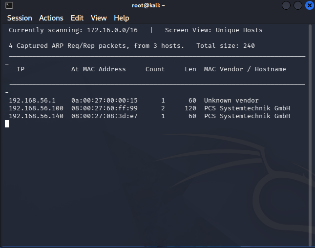

The target is 192.168.56.140

```bash
nbtscan -r 192.168.56.140
```

## Challenge 2 — Fast Nmap Scan

### Steps
**1. Identify the protocol**

```bash
nmap -F <target>
```

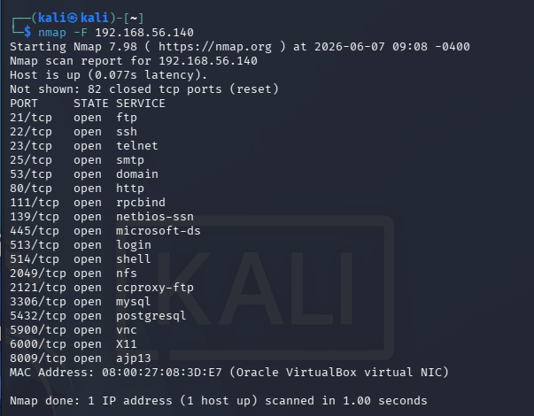

**Challenge 3 — DNS Records**

```bash
nslookup 192.168.56.140
dig ANY 192.168.56.140
dig MX 192.168.56.140
```
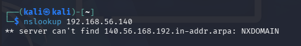

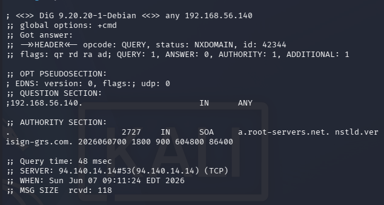

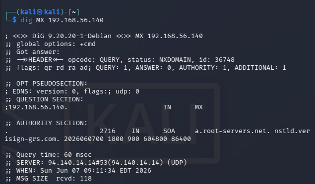

**Challenge 4 — SNMPwalk**

```bash
snmpwalk -v1 -c public 192.168.56.140
```

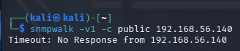

**Challenge 5 — TTL OS Fingerprinting**

```bash
ping -c 4 192.168.56.140
```

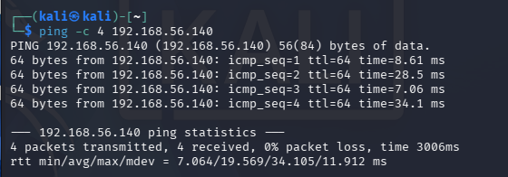

**Challenge 6 — Anonymous LDAP Query**

```bash
ldapsearch -x -H ldap://192.168.56.140 -b "dc=example,dc=com"
```

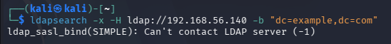

**Challenge 7 — SMTP VRFY / EXPN**

```bash
nc 192.168.56.140 25
```

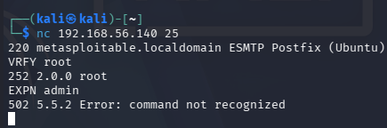

**Challenge 8 — NTP Enumeration**

```bash
ntpq -p 192.168.56.140
```

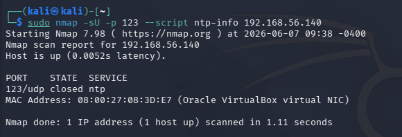

**Challenge 9 — FTP Banner**

```bash
nc <IP> 21
```

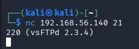

**Challenge 10 — Anonymous FTP Login**

```bash
ftp 192.168.56.140
```

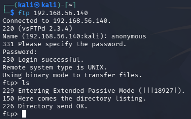
